- First things first, so I added, a target IP to my host file and ran a [[Nmap]] scan
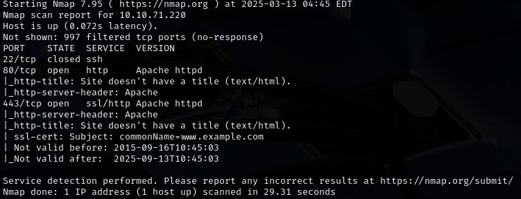

- I could see an Apache server on port 80, so I took a look
- After visit, I saw some GRUB-like loading booting screen, and welcome message with some option to choose later 
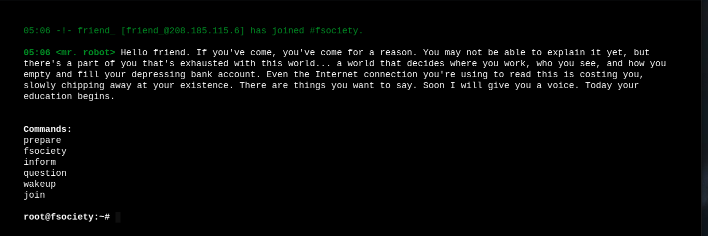
- After visiting, I saw a GRUB-like loading boot screen and a welcome message with some options to choose later
- As a next step, I tried to look around a website, but find out that those are mostly for plot, so I ran a gobuster scan
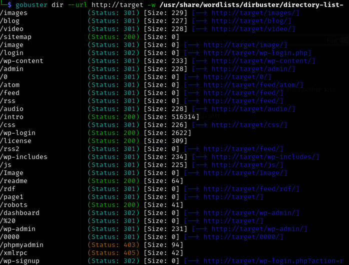
- The scan found a couple of interesting directories with 200 response code, so I checked them manually, and at /robots.txt, I found things I needed to go further, as well as the first flag/key from a total of 3
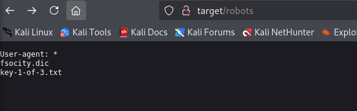
- The dictionary file was an obvious clue to use it against /wp-login directory, so I downloaded this file to use it with Hydra
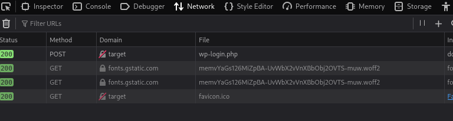
- Here I saw a POST Method used for login
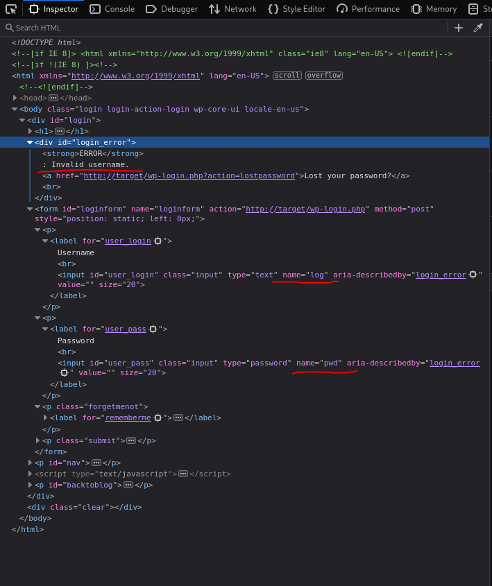
- In the source code I found name of field and error text I needed for Hydra to run
- I ran Hydra with the dictionary file I found earlier, repeated twice, but I also quickly realized that is way too much combination to check, so I try different approach
- I changed the usage of the dictionary file to one random word, as I wanted to take advantage of the error message changes depending on whether the password field was empty or not
- I'm pretty sure that in this way I will find a username, as the error message will change if the correct username is tried
- Command I use:
`hydra -L fsocity.dic -p pass target http-post-form "/wp-login.php:log=^USER^&pwd=^PASS^:Invalid username." -t 64`
- As i thought I found correct usernames although i didn't wait for whole process to be finished 
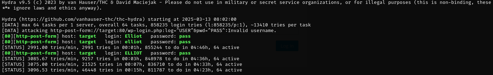
- I ran Hydra one more time with the correct username set and the dictionary file found earlier
- This time it took so much time, i decided that I need to fasten this process
- From previous attack I already know that there is few correct answer accepted is this challenge, so I decided to try my best and sort for only unique positions what resulted in new dictionary
- Command I use:
	- `sort foscity.dic | uniq > fsocity_filtered.dic`
- This worked very well, and as a result, I got a password for the username elliot
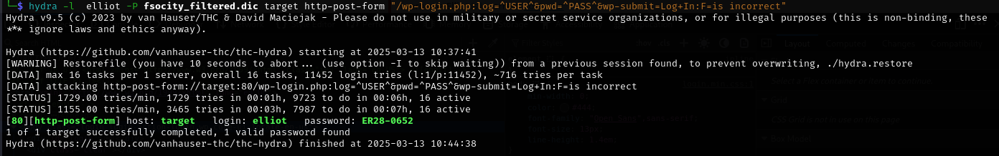
- Pretty quickly, after logging into the WordPress panel, I spotted that an editor allowed me to edit the 404 template
- I change this template for [php-reverse-shell](https://github.com/pentestmonkey/php-reverse-shell/blob/master/php-reverse-shell.php)from pentestmonkey and set up a listener with `nc -lvnp <PORT>`
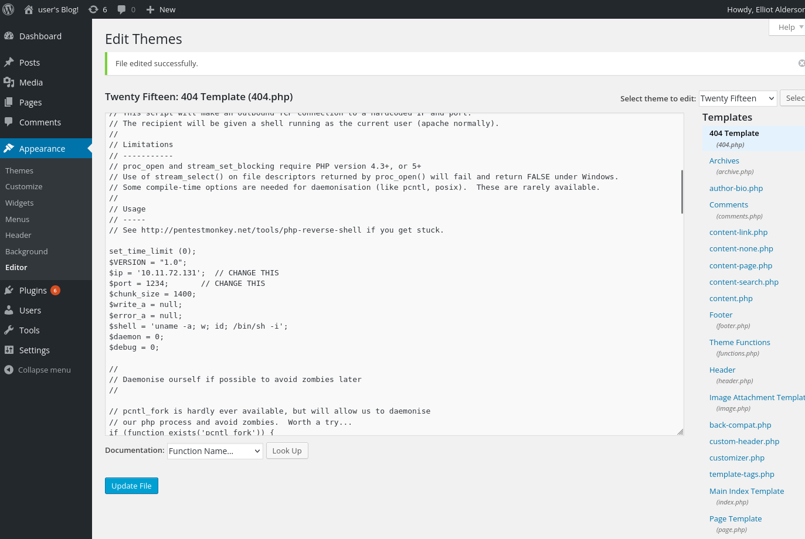

- After access random location like `http://target/asdasd` I received connection and recognize that I'm logged as
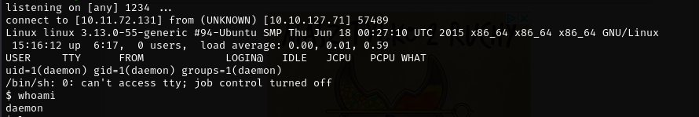
- Then, I stabilized my Netcat shell as shown below
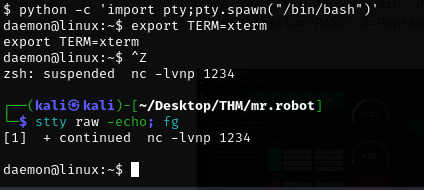
- With a full interactive shell I was able to proceed and enumerate users
- In this way I found user **robot** and found second key and password hash in his home folder
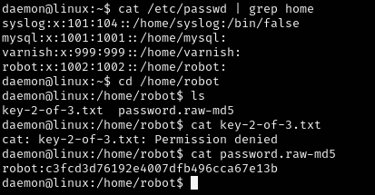
- As I couldn't access the file with the second key, I copied the hash to my machine and proceeded with John 
- Because I knew the format of the hash, things went much quicker, and as a result, I obtained a password for the user robot

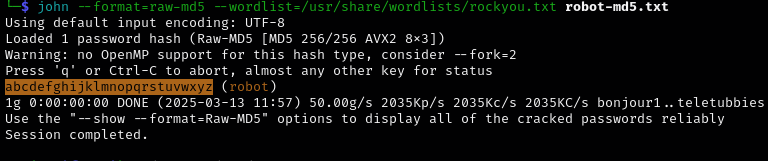
- So i was able to change a user with permission to file with second key
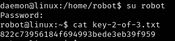
- Now I suppose third key is in /root directory so i need to look for privilage escalation
- Then I checked the files with SUID bits set, found nmap, and with the help of [GTFOBins](https://gtfobins.github.io/gtfobins/nmap/), I successfully escalated my privileges and got the third and final key/flag.
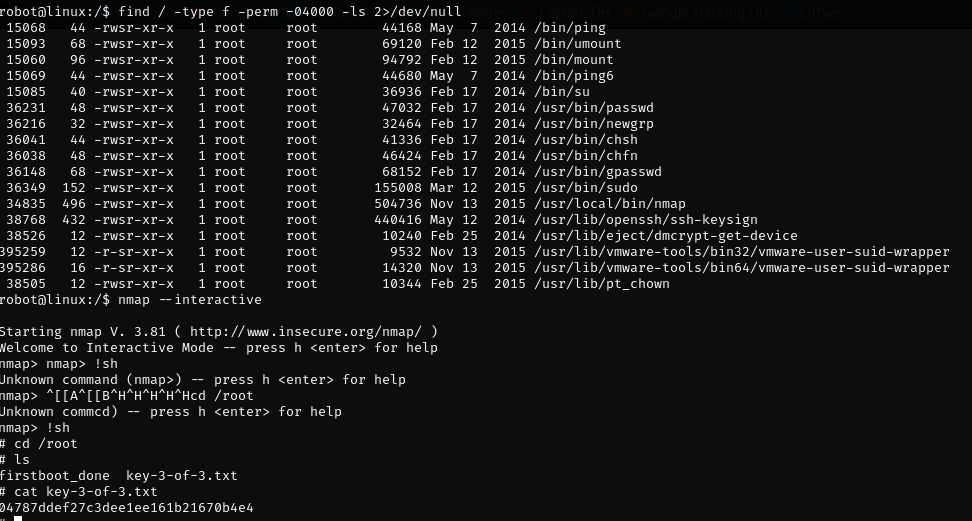
