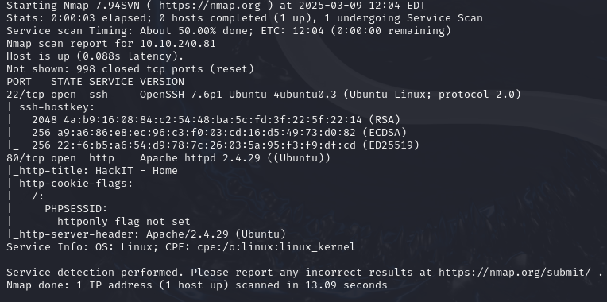
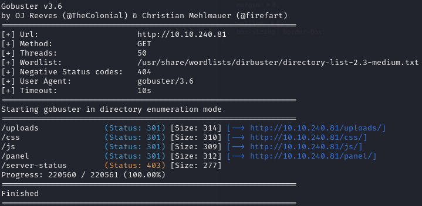

This CTF is designed to guide players through the process step by step by asking questions, which are divided in three separate sections 
# Reconnaissance 
- First, I start with an nmap scan

- Thanks to that I can answer first 3 questions in this section 
- Scan the machine, how many ports are open?
	- 2
- What version of Apache is running?
	- 2.4.29
- What service is running on port 22?
	- ssh

- Now in order to answer next question i have to run gobuster to look for hidden directories

- The answer was **/panel** 

# Getting a shell
After I visit a subsite from last question, I can see:

Now I tried to upload a PentestMonkey PHP reverse shell, but the `.php` extension was forbidden, so I tried to add a PHP null byte at the end, or a PHP null byte with .jpg, like `%00` and `%00.jpg`, but even though it was correctly uploaded, the file wasn't executed.

- After some digging, I changed it to `.php5`, and it worked.
- I can run it by accessing it through the /uploads directory.
- Now I want to stabilize a reverse shell, so I run:
    - `python -c 'import pty;pty.spawn("/bin/bash")'`
    - `export TERM=xterm`
    - then CTRL + Z
    - `stty raw -echo; fg'
- After receiving an interactive shell, I'm going to search for a flag in user.txt.
  

- The next question was
	- Search for files with SUID permission, which file is weird?
- To find an answer i ran
	- `find / -type f -perm -04000 -ls 2>/dev/null`
- After comparing the list of files with https://gtfobins.github.io/#+suid, I could see that the file /usr/bin/python could potentially be used, and this was the answer to the next question.
- With help of Gtfobins, i ran
	- `python -c 'import os; os.execl("/bin/sh", "sh", "-p")'`
- So I had root privileges by then and was able to access root.txt at /root.
